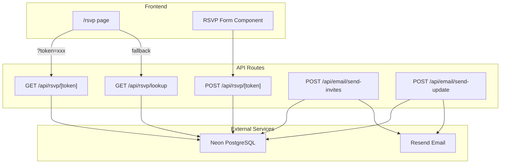

# RSVP Backend System with Email Integration

## Architecture Overview




## Database Schema

Two tables in Neon PostgreSQL:

**households**

- `id` (uuid, primary key)
- `email` (text, unique) - shared email for the household
- `unique_token` (text, unique) - for RSVP links
- `invite_sent_at` (timestamp, nullable)
- `last_update_sent_at` (timestamp, nullable)
- `created_at` (timestamp)

**guests**

- `id` (uuid, primary key)
- `household_id` (uuid, foreign key)
- `first_name` (text)
- `last_name` (text)
- `is_attending` (boolean, nullable) - null until RSVP submitted
- `dietary_requirements` (text, nullable)
- `rsvp_completed_at` (timestamp, nullable)

## Tech Stack

- **Database**: Neon PostgreSQL via `@neondatabase/serverless`
- **ORM**: Drizzle ORM (lightweight, type-safe, works great with Neon)
- **Email**: Resend with React email templates
- **Auth for admin endpoints**: Simple API key check (env var)

## Implementation Files

### New files to create:

- `[src/db/schema.ts](src/db/schema.ts)` - Drizzle schema definitions
- `[src/db/index.ts](src/db/index.ts)` - Database connection setup
- `[src/app/api/rsvp/[token]/route.ts](src/app/api/rsvp/[token]/route.ts)` - GET (validate) + POST (submit)
- `[src/app/api/rsvp/lookup/route.ts](src/app/api/rsvp/lookup/route.ts)` - Name lookup fallback
- `[src/app/api/email/send-invites/route.ts](src/app/api/email/send-invites/route.ts)` - Batch send invites
- `[src/app/api/email/send-update/route.ts](src/app/api/email/send-update/route.ts)` - Send updates
- `[src/emails/invitation.tsx](src/emails/invitation.tsx)` - Invitation email template
- `[src/emails/update.tsx](src/emails/update.tsx)` - Update email template
- `[src/app/rsvp/page.tsx](src/app/rsvp/page.tsx)` - RSVP page with form

### Files to modify:

- `[src/app/components/RSVP.tsx](src/app/components/RSVP.tsx)` - Update link to point to `/rsvp`
- `[package.json](package.json)` - Add dependencies

## RSVP Flow

1. Guest receives email with unique link: `yoursite.com/rsvp?token=abc123`
2. Page validates token, fetches household + all guests
3. Form displays all guest names with:
  - Attendance toggle (Yes/No) per guest
  - Dietary requirements text field per guest
4. Submit saves responses for all household members
5. **Fallback**: If no token or invalid, show name lookup form

## Email Flow

1. Admin calls `POST /api/email/send-invites` with API key
2. System fetches all households where `invite_sent_at` is null
3. For each household: send email via Resend, update `invite_sent_at`
4. Updates work similarly via `POST /api/email/send-update`

## Data Import

You'll need to run a one-time script to import your Google Sheet data into Neon. I'll create a seed script that accepts CSV or you can use Neon's import feature directly.

## Environment Variables Needed

```
DATABASE_URL=          # From Neon dashboard
RESEND_API_KEY=        # From Resend dashboard
ADMIN_API_KEY=         # Generate a random string for protecting email endpoints
NEXT_PUBLIC_BASE_URL=  # Your site URL for email links
```

## Dependencies to Install

```bash
npm install @neondatabase/serverless drizzle-orm resend react-email @react-email/components
npm install -D drizzle-kit
```

